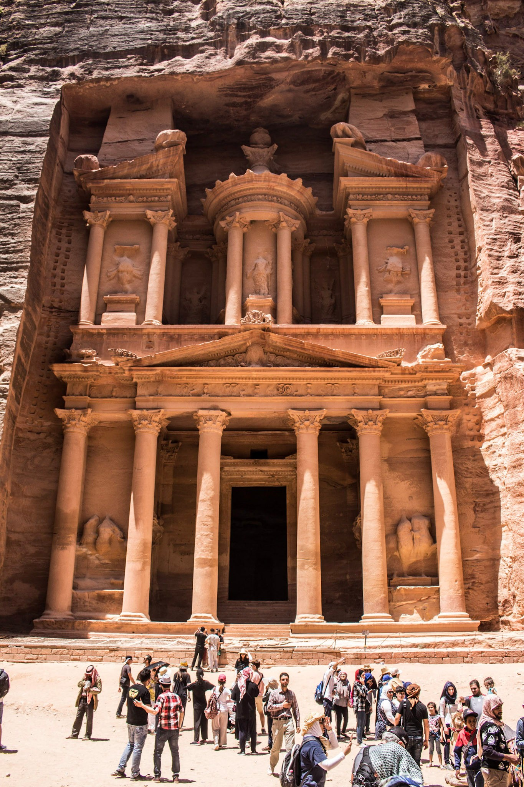

# About the Project
This is a start of a design of a 3D design of the Middle eastern city of Petra(Google it if you don't know what it is).
 
<a href = "demo.html">Demo</a>

# Library used

https://threejs.org/

Chcek out source code repositry here

https://github.com/mrdoob/three.js/

# Screen shots
Here is a real photo that I took at petra.
Screen shots will appear when I have something to show

